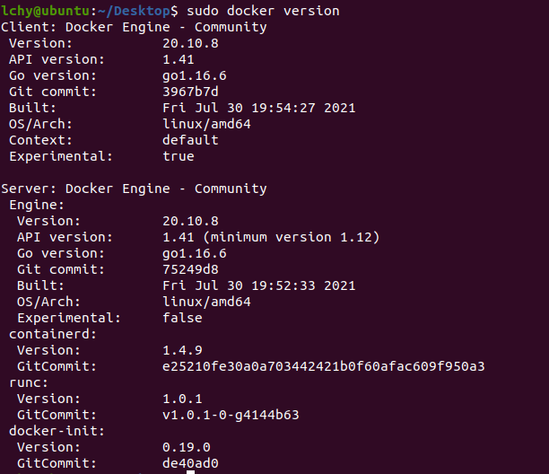

# study_Docker
Docker 공부를 하면서 정리하는 Repository

### Background
- 계속 바뀌는 개발 환경 때문에 다양한 환경에 대해서 관리하는데 문제가 있었지만 도커가 등장하고 서버관리/개발 방식이 완전히 바뀌게 된다.
- 전통적인 방식은 한땀 한땀 다 사용자가 해야 한다. 하지만 도켜를 사용하면 어떠한 프로그램도 컨테이너로 만드는 것이 가능하여 어디서든 돌아간다.

## Docker
- 컨테이너 기반의 오픈소스 가상화 플랫폼이다.
- 컨테이너는 가상머신처럼 독립적으로 실행되지만 빠르고, 쉽고, 효율적이다.
- 격리된 환경에서 작동하는 프로세스로 리눅스 커널의 여러 기술을 활용한다.
- 하드웨어 가상화 기술보다 가볍고, 이미지 단위로 프로세스 실행 환경을 구성한다.
- Client-Server 구조
    

    - docker CLI는 도커 호스트에 명령을 전다하고 결과를 받아 출력한다.
- 특징 
    - 확장성/이식성: 도커가 설치되어 있다면 어디서든 컨테이너를 실행할 수 있고 쉽게 개발서버를 만들 수 있고 테스트 서버 생성도 간편하다.
    - 표준성: 컨테이너라는 표준으로 서버를 배포하므로 모든 서비스들의 배포과정이 동일해진다.
    - 이미지: 이미지에서 컨테이너를 생성하기 때문에 반드시 이미지를 만드는 과정이 필요하다 Dockerfile을 이용하여 이미지를 만들고 해당 이미지를 이미지 저장소에 저장하고 운영서버에서 이미지를 불러올 수 있다.
    - 설정관리: 설정은 보통 환경변수로 제어한다. MYSQL_PASS=password와 같이 컨테이너를 띄울 때 환경변수를 같이 지정하게 되는데 하나의 이미지가 환경변수에 따라 동적으로 설정파일을 생성하도록 만들어져야 한다.
    - 자원관리: 컨테이너는 삭제 후 새로 만들면 모든 데이터가 초기화되기 대문에 업로드 파일을 외부 스토리지와 링크하여 사용하거나 별도의 저장소가 필요하다.
- 도커가 가져온 변화
    - 관리하기 쉽고 다른 프로세스와 격리되어 성능저하가 거의 없다.
    - 복잡한 기술을 몰라도 사용할 수 있다.
    - 코드와 설정으로 관리 후 재현 및 수정이 가능하다.
    - 오픈 소스이기 때문에 특정 회사 기술에 종속적이지 않는다.

### Container
- 기능
    - 스케줄링
        - 컨테이너를 적당한 서버에 배포해주는 작업이다.
        - 여러 대의 서버 중 가장 할 일 없는 서버에 배포하거나 그냥 차례대로 배포 또는 아예 랜덤하게 배포한다.
        - 컨테이너 개수를 여러 개로 늘리면 적당히 나눠서 배포하고 서버가 죽으면 실행 중이던 컨테이너를 다른 서버에 띄워준다.
    - 클러스터링
        - 여러 개의 서버를 하나의 서버처럼 사용한다.
        - 작게는 몇 개 안되는 서버부터 많게는 수천 대의 서버를 하나의 클러스터로 사용한다.
        - 여기저기 흩어져 있는 컨테이너도 가상 네트워크를 이용하여 마치 같은 서버에 있는 것처럼 쉽게 통신한다.
    - 서비스 디스커버리
        - 서비스를 찾아주는 기능이다.
        - 클러스터 환경에서 컨테이너는 어느 서버에 생성될지 알 수 없고 다른 서버로 이동 할 수도 있다.
        - 따라서 컨테이너와 통신을 하기 위해서 어느 서버에서 실행중인지 알아야 하고 컨테이너가 생성되고 중지될 때 어딘가 IP와 Port와 같은 정보를 업데이트해줘야 한다.
        - Key-value 저장소에 정보를 저장할 수도 있고 내부 DNS 서버를 이용할 수도 있다.
### VM vx Docker

- overhead: 속도를 느리게 하는 부분인데 Docker는 격리시키기 때문에 이 부분이 없고 속도가 빠르다.

#### Jenkins
- Java로 만들어진 CICD 파이프 라인을 구성하는 툴이다.

#### Wordpress
- php로 만들어진 블로그를 하기 위한 도구이다.

#### rocket-chat
- Slack같이 무료 오픈 소스, 자체 호스팅 채팅 응용 프로그램으로 자체 채팅 서버를 호스팅할 수 있다.

#### 상태관리 도구
- 어떤 명령를 입력하였는지 문서화하였다고 하면 어떤 설정 파일로 관리를 해 그 프로그램을 돌리면 설정이 사람이 돌리는 것처럼해서 서버를 관리하는 것이다.
- CHEF, puppet labs, ANSIBLE

### Docker Installation
- Linux Ubuntu 경우
```
curl -fsSL https://get.docker.com/ | sudo sh
sudo usermod -aG docker [ubuntu 사용자 계정 이름]
```
- 설치 확인법
    다음과 같이 입력 시 다음 창이 뜬다.
    ```
    docker version
    ```
    


